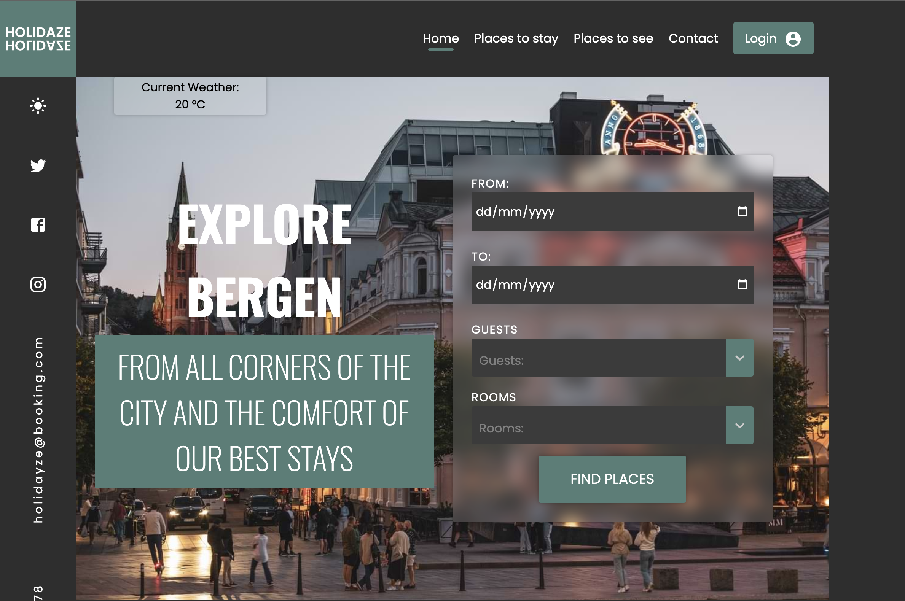

# project-exam-2022-emma-ford



## Built with

- Next.Js
- Tailwind CSS
- SCSS

## Info

```
Super Admin:
Email: admin@admin.com
Password: Password1234

Admin:
Email: user@user.com
Password: Password1234

```

```
1. clne the repo

2. npm i

3. npm run dev
```

## API

```
- https://project-exam-2022.herokuapp.com/
```

## Assignment:

Hotel Booking Website
A local tourism agency in Bergen is launching a new website called ‘Holidaze’ for visitors to the area to be able to find hotels, B&Bs and guesthouses, and for the accommodation owners to receive enquiries.

The project requires you to create the visitor side of the website where users can search accommodation and make enquiries, as well as the administration side where properties can be added and enquiries managed.

You will need to create an API to store the data for the establishments, enquiries and contact submissions. You can choose to use WordPress or Strapi as a Headless CMS, but it is very important that the API is deployed and publicly available. Please do not submit any files for your API. Only submit the website you have created.

## Requirements:

### Visitor Side

- Homepage
- Search bar typeahead (auto dropdown with hotel names that match what has been typed)
- A results page with all hotels
- The hotel specific page which displays all details about the hotel
- An enquiry page either modal or separate page
- A contact page (different to enquiry page) which goes to the admin for Holidaze

### Admin side

- Create a login section that makes use of JWT tokens
- List of enquiries and new enquiries appear when user submits the form on the enquiry page
- List of messages from contact form
- The admin can create a new establishment
- Recommended Process

## Contact Me

LinkedIn: https://www.linkedin.com/in/emmathurmer/
